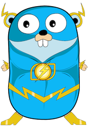

# syn-scanner
Simple SYN/ACK scanner on go.
Pet project for GoLang skills promotion.



## Usage
``` shell
go run . scan syn <target> [--threads number of threads]
```

### Scanners
- **syn** - SYN/ACK scanner

### Arguments SYN/ACK scanner
```
  <target> string
        target for scanning
```

### Flags
```
  --threads int
        number of scan threads (default 64)
```
